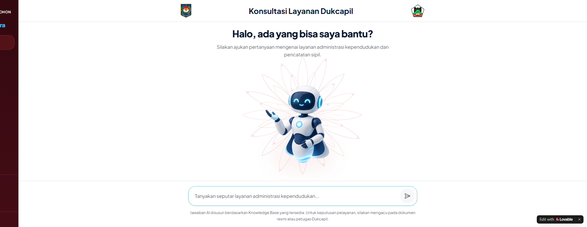
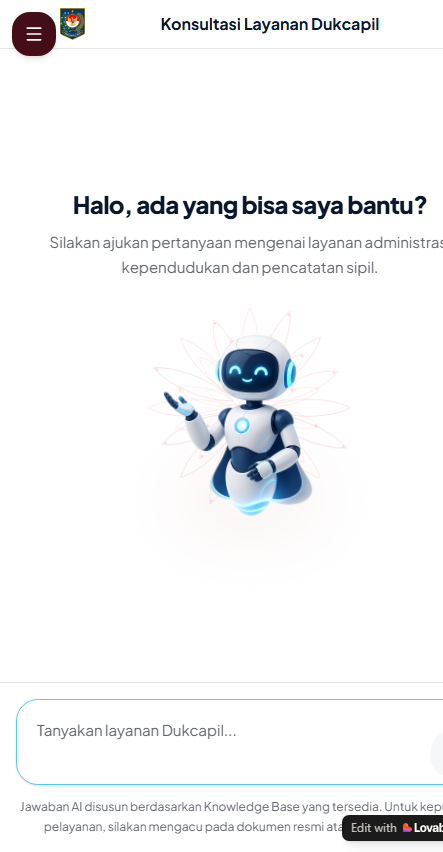
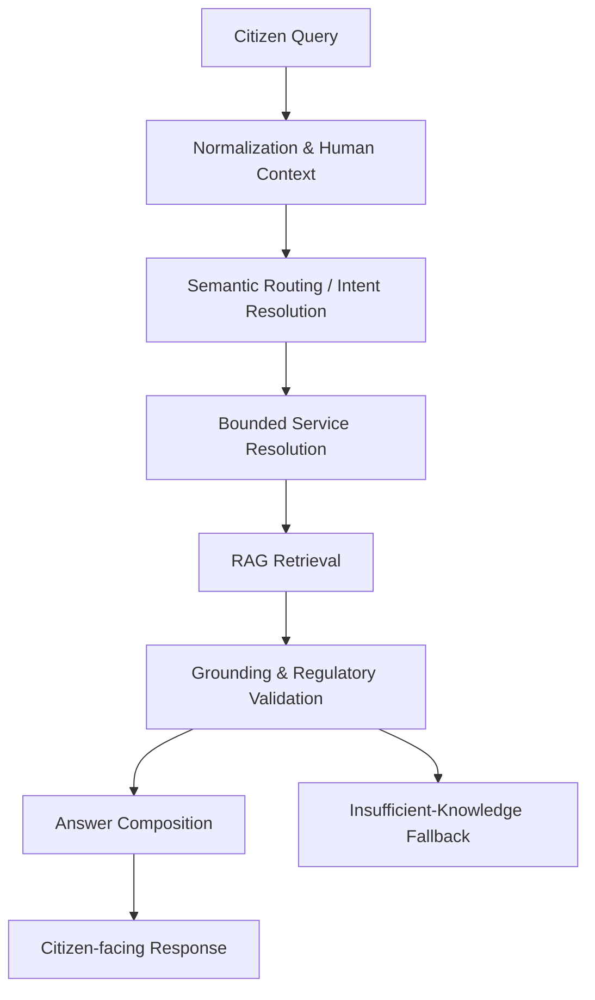

# La Dukca PRIMA Integra

**Production-oriented AI service assistant for Indonesian civil registration services, built with FastAPI, retrieval-augmented generation, semantic routing concepts, and grounded response validation.**

> This repository is a **sanitized portfolio snapshot**. It is intentionally separate from the private development/production repository and is not a deployment source of truth.

## Overview

La Dukca PRIMA Integra helps citizens understand population-administration and civil-registration services (Dukcapil) using everyday language rather than requiring users to know formal service names.

The system is designed around a bounded AI pipeline: interpret citizen intent, resolve the relevant service context, retrieve supporting material, validate claims against available evidence, and return a structured citizen-facing answer. It does **not** claim direct access to Indonesia's population database.

## Application Preview

The public product surface is designed as a responsive, citizen-facing consultation experience. These screenshots show only the public consultation interface; private administration and operational control-plane screens are intentionally excluded from this portfolio snapshot.

### Desktop Citizen Consultation



### Responsive Mobile Experience

<p align="center">
  
</p>

## The Problem

Public-service questions are difficult for a generic chatbot because:

- citizens use informal, incomplete, typo-prone, or overlapping language;
- multiple services can appear relevant to a single question;
- follow-up turns depend on prior context;
- procedural and legal guidance must remain grounded;
- unsupported claims can create real administrative confusion;
- privacy-sensitive identifiers must not be treated like ordinary chat content.

## Architecture



The language model is one component inside a larger application pipeline. Routing, retrieval boundaries, validation, response contracts, and safety behavior are owned by application code.

## Key Engineering Features

- FastAPI backend architecture.
- Retrieval-Augmented Generation (RAG).
- Semantic routing / bounded intent resolution before retrieval.
- Multi-turn conversation context.
- Privacy and sensitive-data screening.
- Deterministic insufficient-knowledge fallback.
- Grounded answer validation.
- Source-aware response composition.
- Structured legal/procedural output.
- Regression-oriented automated testing.
- Fail-closed behavior for insufficient evidence.
- Token and retrieval-scope efficiency controls.

## SRL + RAG

A conventional RAG flow is often:

```text
query -> retrieval -> generation
```

La Dukca uses an additional semantic-resolution step so retrieval is constrained before generation:

```text
citizen language
    -> semantic intent / condition resolution
    -> bounded retrieval
    -> grounding validation
    -> answer composition
```

This public snapshot documents the architecture without publishing protected routing rules, internal acceptance datasets, or hidden qualification cases.

See [docs/srl-rag-overview.md](docs/srl-rag-overview.md).

## Engineering Orchestration — VENOM OS

Development of La Dukca PRIMA Integra follows a structured AI-assisted engineering methodology referred to as **VENOM OS**.

VENOM OS is not a conventional operating system. It is an engineering orchestration framework designed around:

- authoritative-state verification before action;
- explicit authority boundaries;
- bounded execution;
- audit-driven corrective work;
- qualification before promotion;
- evidence-based PASS / FAIL decisions;
- protection of already-qualified behavior;
- fail-closed handling of unresolved evidence;
- controlled promotion and post-change verification.

The public repository documents only the methodology. Protected operational prompts, internal qualification datasets, deployment identifiers, and production-control procedures are intentionally excluded.

See [docs/venom-os.md](docs/venom-os.md).

## Response Contract

Citizen-facing responses can be composed using a consistent structure:

- Greeting
- Service Reference
- Requirements
- Legal Basis
- Officer / Official Contact
- Insufficient-knowledge fallback when evidence is insufficient

The exact wording can vary by service and conversation context.

## Technology Stack

### Backend

- Python 3.14
- FastAPI
- Pydantic
- SQLAlchemy
- Alembic
- OpenAI API
- Embeddings / semantic retrieval
- NumPy
- Pytest
- Ruff

### Delivery / Application Engineering

- Git / GitHub
- Docker-compatible backend packaging
- Migration validation
- API contract testing
- Regression testing
- Structured error handling

The production frontend is maintained separately and is not included in this portfolio snapshot.

## Quality Engineering

The repository demonstrates the engineering patterns used around the AI layer:

- unit and integration testing;
- explicit API contracts;
- retrieval and grounding validation;
- privacy-aware request handling;
- deterministic fallbacks;
- migration-managed persistence;
- targeted regression testing.

Protected held-out sets, internal canary datasets, qualification evidence, and production-promotion artifacts are deliberately excluded.

## Repository Structure

```text
.
├── README.md
├── LICENSE
├── .gitignore
├── backend/
│   ├── README.md
│   ├── .env.example
│   ├── pyproject.toml
│   ├── app/
│   ├── alembic/
│   └── tests/
├── frontend/
│   └── README.md
├── docs/
│   ├── screenshots/
│   │   ├── la-dukca-desktop.png
│   │   └── la-dukca-mobile.png
│   ├── architecture.md
│   ├── srl-rag-overview.md
│   ├── venom-os.md
│   └── security-and-privacy.md
└── .github/
    └── SECURITY.md
```

## Local Development

From the repository root:

```powershell
cd backend
python -m venv .venv
.\.venv\Scripts\Activate.ps1
python -m pip install --upgrade pip
pip install -r requirements.txt
Copy-Item .env.example .env
python -m alembic upgrade head
python -m uvicorn app.main:app --reload --host 127.0.0.1 --port 8000
```

Open:

```text
http://127.0.0.1:8000/docs
```

Run the included representative tests with:

```powershell
pytest
```

The public snapshot intentionally does not include production knowledge data. A local instance therefore may exercise fallback behavior unless you provide your own non-sensitive development knowledge material.

## Security & Privacy

This repository is intentionally sanitized:

- no citizen production data;
- no production database;
- no production credentials;
- no private API keys;
- no internal infrastructure identifiers;
- no protected held-out acceptance sets;
- no public admin/authentication control-plane endpoints;
- no production auto-deployment workflow.

See [docs/security-and-privacy.md](docs/security-and-privacy.md).

## Project Status

**Production-oriented implementation / actively developed system.**

This repository is a portfolio-safe snapshot and should not be interpreted as the complete production source, operational SSOT, or deployment repository.

## Author

**Frendklien**

Computer / IT professional with experience in government digital services, Python backend development, AI integration, RAG, semantic routing, and production-oriented application engineering.
