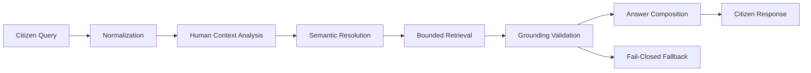

# Architecture

## Design Goal

La Dukca PRIMA Integra is designed as an application-controlled AI consultation pipeline rather than a free-form chatbot.

The backend separates interpretation, retrieval, validation, and response construction so that generation is constrained by application state and available evidence.

## High-Level Flow

## Main Layers

### API Layer

FastAPI routes expose bounded public endpoints and application health/system endpoints. Request IDs, exception handling, and configuration are managed centrally.

### Conversation Layer

The conversation services coordinate context, intent resolution, clarification, retrieval, generation, formatting, and validation.

### Retrieval Layer

Knowledge retrieval is separated from response generation. The architecture supports bounded candidate selection and evidence-aware answer construction.

### Validation Layer

Generated material is validated before it becomes a citizen-facing answer. If available evidence is insufficient, the system can return an insufficient-knowledge response rather than inventing a procedure.

### Persistence Layer

SQLAlchemy models and Alembic migrations provide explicit schema evolution and session/message persistence patterns.

## Public Snapshot Boundary

This repository intentionally omits protected qualification logic, hidden acceptance sets, internal operational evidence, production data, and deployment wiring. The architecture shown here is intended to demonstrate engineering structure without exposing protected QA mechanisms.
