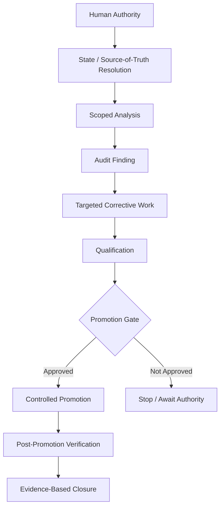

# VENOM OS

## AI-Assisted Engineering Orchestration Framework

VENOM OS is the engineering operating methodology used to structure AI-assisted development work around La Dukca PRIMA Integra.

It is not an operating system in the conventional computer-platform sense. It is a disciplined orchestration framework for controlling how AI-assisted engineering work is scoped, executed, verified, promoted, and stopped.

The public description focuses on the methodology only. Operational prompts, protected qualification datasets, production identifiers, hidden evaluation cases, and deployment control details are intentionally excluded.

## Why It Exists

AI coding agents can move quickly, but speed alone is not a sufficient engineering property. Production-oriented work also requires:

- explicit scope boundaries;
- reliable state continuity;
- controlled authority for mutations;
- separation between analysis and execution;
- evidence before acceptance;
- repeatable qualification;
- clear promotion gates;
- rollback awareness;
- protection of frozen or already-qualified behavior.

VENOM OS provides a repeatable operating discipline around those concerns.

## Core Principles

### 1. State Before Action

Work begins by resolving the current authoritative project state before making changes.

Previously completed work is not reopened without a concrete reason, and stale conversational context is not treated as stronger than the project's current source of truth.

### 2. Explicit Authority Boundaries

Analysis, corrective work, qualification, promotion, and production mutation are treated as distinct levels of authority.

A successful analysis does not automatically authorize a code change, and a qualified code change does not automatically authorize production promotion.

### 3. Bounded Execution

Each task is constrained to the smallest justified scope.

The framework discourages unrelated cleanup, broad refactoring, reopening frozen areas, and changing already-qualified behavior merely because it is technically possible.

### 4. Evidence-Based Acceptance

A change is accepted because the relevant evidence supports it, not because an agent reports that it is finished.

Evidence may include targeted tests, regression tests, static analysis, controlled reproductions, or post-change verification appropriate to the scope.

### 5. Audit-Driven Corrective Work

A typical lifecycle is:

```text
authoritative state
    -> scoped analysis
    -> audit finding
    -> targeted corrective
    -> qualification
    -> promotion gate
    -> controlled release
    -> verification
```

A failed gate returns work to the narrowest corrective point rather than restarting unrelated milestones.

### 6. Fail Closed on Uncertainty

If required evidence is missing, inconsistent, stale, or insufficient, the framework prefers an explicit unresolved state over an unsupported PASS claim.

### 7. Preserve Qualified Boundaries

Previously accepted behavior is treated as a protected boundary unless new evidence justifies reopening it.

This reduces regression risk and prevents AI-assisted work from continuously rewriting stable areas.

## Public Workflow Model



## Relationship to La Dukca PRIMA Integra

Within La Dukca, VENOM OS is used as an engineering control layer around the software lifecycle rather than as part of the citizen-facing runtime.

The application architecture handles semantic resolution, retrieval, grounding, validation, and response composition. VENOM OS governs how engineering changes to that system are reasoned about, qualified, and promoted.

This separation is intentional:

- **La Dukca runtime** solves the citizen-service problem.
- **VENOM OS** structures the engineering process used to evolve that runtime safely.

## Security and Publication Boundary

This public repository documents only the high-level methodology.

It does not publish:

- production credentials or environment values;
- private repository history;
- infrastructure or deployment identifiers;
- operational source-of-truth document identifiers;
- protected held-out evaluation sets;
- hidden qualification cases;
- internal canary or shadow datasets;
- exact production-promotion criteria;
- private operational prompts;
- citizen data, logs, or production database contents.

The goal is to demonstrate disciplined AI-assisted engineering without exposing operational control material.

## Engineering Value

The framework is intended to make AI-assisted software engineering more:

- auditable;
- reproducible;
- scope-controlled;
- evidence-driven;
- rollback-aware;
- safer around production boundaries;
- easier for a human operator to supervise.

VENOM OS is therefore best understood as an **AI engineering operating methodology and orchestration framework**, not as a standalone software product.
